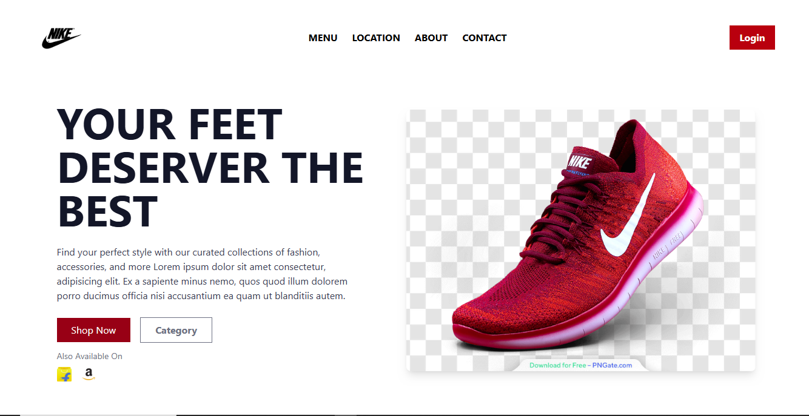

# Nike Footwear Landing Page



## 📝 Project Overview

This is a **Nike-inspired landing page** designed to promote high-performance footwear with a sleek and modern UI. It includes a hero section with a compelling headline, product display, call-to-action buttons, and links to online marketplaces.

---

## 🚀 Live Demo

Check out the live version of this project here:

🔗 [View Live Site](https://cover-page.onrender.com/)

---

## 🚀 Features

- ✨ Clean, modern design with Nike branding
- 🖼️ Hero section featuring a transparent shoe image
- 📢 Bold headline: **"YOUR FEET DESERVER THE BEST"** (note: typo in "DESERVER")
- 🛒 Action buttons: `Shop Now` and `Category`
- 🛍️ Availability on Flipkart and Amazon
- 🔗 Navigation: Menu, Location, About, Contact
- 🔐 Login button in top-right

---

## 📦 Technologies Used

- HTML5
- CSS3
- (Optional) JavaScript for interactivity
- Web fonts and PNG assets

---

## 🛠️ How to Clone and Run Locally

Follow these steps to clone and run the landing page locally on your machine:

```bash
# Step 1: Clone the repository
git clone https://github.com/your-username/nike-landing-page.git

# Step 2: Navigate into the project folder
cd nike-landing-page

# Step 3: Run
cd npm run dev

# Now open your browser and go to:
http://localhost:1573

```

## Contributing

Contributions are welcome! If you'd like to help improve this project, feel free to:

- 🔧 Fix bugs or typos (like "DESERVER" ➜ "DESERVE")
- 💡 Suggest or add new features
- 🧪 Improve design or responsiveness
- 📝 Enhance documentation

---

## 👨‍💻 Author

**Brajesh Chhekur**

📧 Email: 281092322419e@gmail.com _(optional)_  
If you like this project, feel free to ⭐ star it, fork it, or open an issue!
